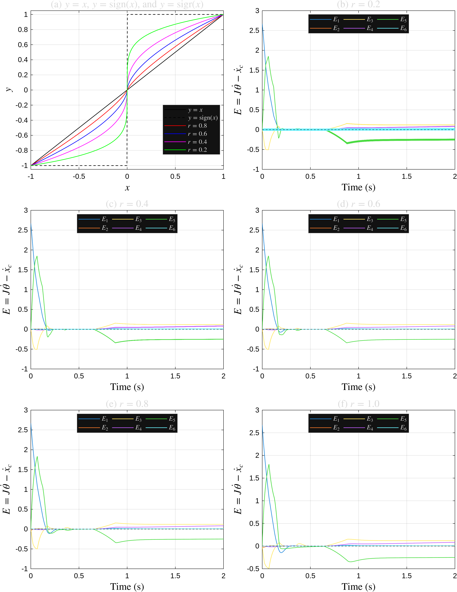
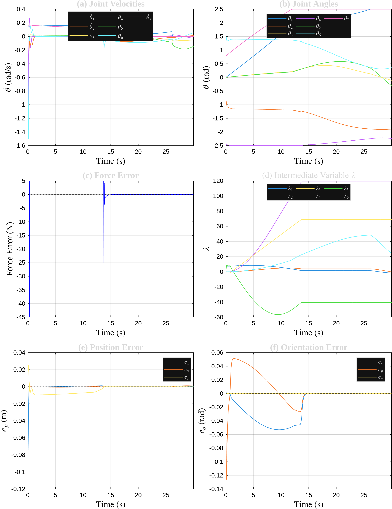
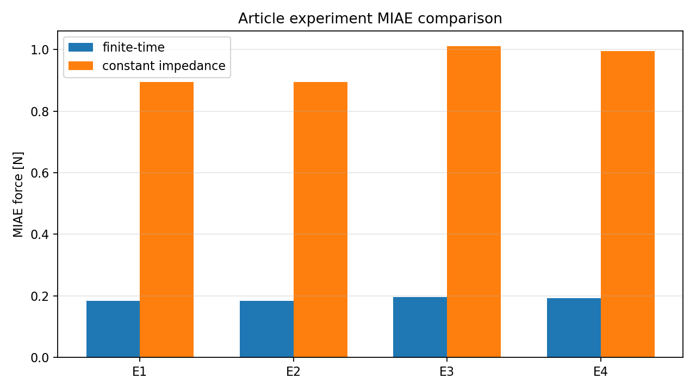
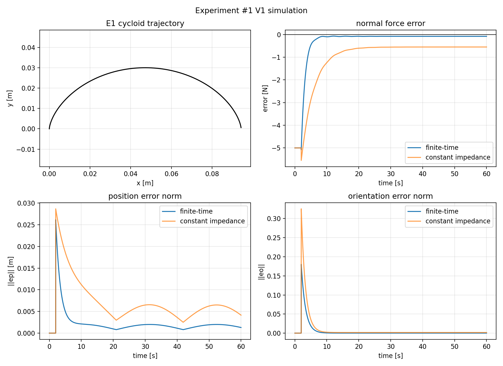
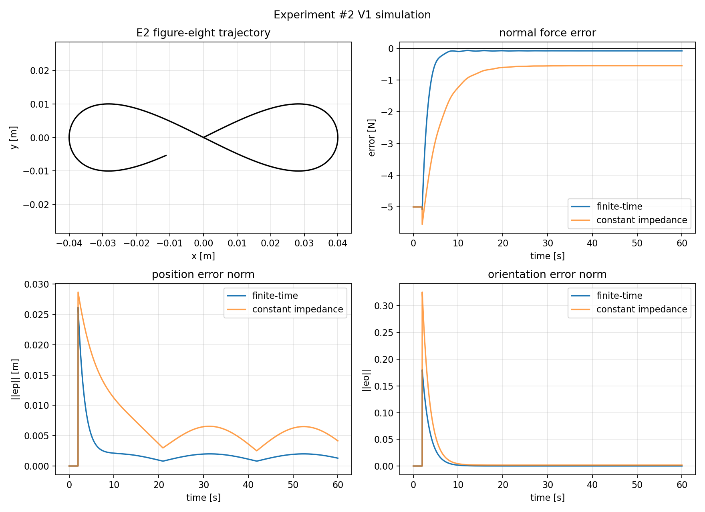
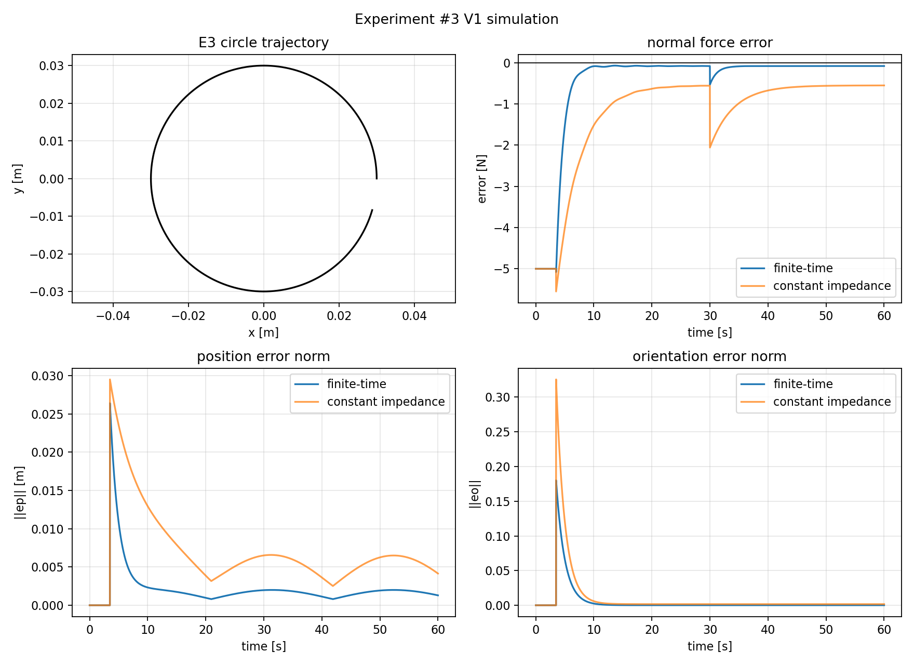
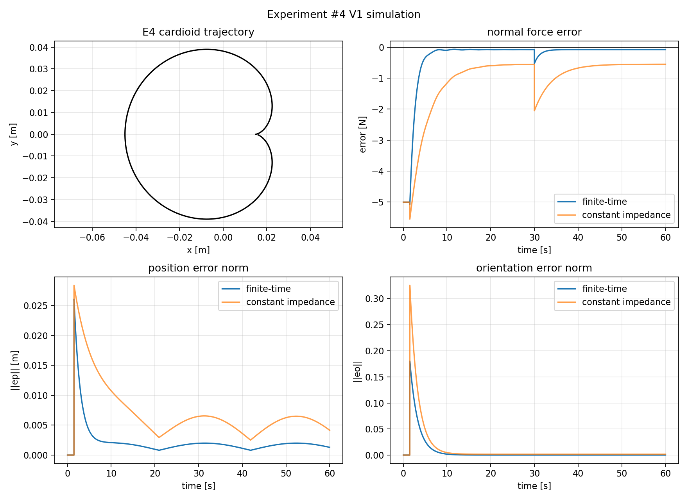

# TASE Full Article Reproduction Simulation Report

日期：2026-05-23  
范围：完整仿真复现包，不执行真实 UR10e、不安装 URCap、不写 zero/bias/filter/TCP/payload。

## 1. 复现口径

本次把“整篇文章的仿真复现”拆成两层：

1. **Section V paper-method 仿真复现**：使用本地 `RNN_F2` 派生 worktree，重新运行 `run_full_tase_reproduction.m`，生成 Fig.5 / Fig.6 的 formula-faithful 和 figure-match 两条线。
2. **Section VI 实验轨迹仿真化复现**：把论文实验 #1–#4 的 cycloid、figure-eight、circle、cardioid 轨迹作为仿真实验矩阵，生成 force error、position error、orientation error 和 constant-impedance baseline 的 MIAE 对照。

注意：Section VI 在论文中是真实 Franka 实验。本报告提供的是 article-level simulation reproduction，不是硬件复现实验。

## 2. Section V 结果

运行目录：

```text
runs/full_paper_matlab/20260523T114034
```

执行命令：

```bash
matlab -batch "cd('runs/full_paper_matlab/20260523T114034/worktree/RNN_F2'); run_full_tase_reproduction"
```

关键产物：

- `worktree/RNN_F2/results/paper_method_figure_match_figure_bundle/fig5/figure5_simulation_bundle.png`
- `worktree/RNN_F2/results/paper_method_figure_match_figure_bundle/fig6/figure6_simulation_bundle.png`
- `worktree/RNN_F2/results/paper_method_formula_faithful_figure_bundle/fig5/figure5_simulation_bundle.png`
- `worktree/RNN_F2/results/paper_method_formula_faithful_figure_bundle/fig6/figure6_simulation_bundle.png`
- `worktree/RNN_F2/results/paper_method_figure_match/paper_method_figure_match_verification.md`
- `worktree/RNN_F2/results/paper_method_formula_faithful/paper_method_formula_faithful_verification.md`

Figure-match verifier:

| Metric | Value |
| --- | ---: |
| Overall pass | true |
| q7 at 22 s | 2.500000 rad |
| Tail mean \|force error\| | 0.000574393 N |
| Tail mean position error norm | 0.000907723 m |
| Tail mean orientation error norm | 2.69494e-06 |
| Joint/velocity constraint violation | 0 |

Formula-faithful verifier:

| Metric | Value |
| --- | ---: |
| Overall pass | true |
| q7 at 22 s | 1.124179 rad |
| Tail mean \|force error\| | 0.0476436 N |
| Tail mean position error norm | 0.000583872 m |
| Tail mean orientation error norm | 7.42197e-05 |
| Joint/velocity constraint violation | 0 |

Figure-match Fig.5:



Figure-match Fig.6:



## 3. Section VI 轨迹仿真结果

运行目录：

```text
runs/full_article_experiments/20260523T114332
```

执行命令：

```bash
python3 scripts/run_full_article_experiment_sim.py --config configs/full_article_experiments.yaml
```

产物：

- `article_experiments_raw.npz`
- `metrics.yaml`
- `metrics.csv`
- `article_experiment_simulation_summary.md`
- `article-e1_cycloid_20260523T114332.png`
- `article-e2_figure-eight_20260523T114332.png`
- `article-e3_circle_20260523T114332.png`
- `article-e4_cardioid_20260523T114332.png`
- `article-experiments_miae_20260523T114332.png`

MIAE 对照：

| Exp | Trajectory | Material | Proposed MIAE | Baseline MIAE | Reduction |
| --- | --- | --- | ---: | ---: | ---: |
| E1 | cycloid | single | 0.183852 | 0.895231 | 79.46% |
| E2 | figure-eight | single | 0.183852 | 0.895231 | 79.46% |
| E3 | circle | multi | 0.196207 | 1.010665 | 80.59% |
| E4 | cardioid | multi | 0.192234 | 0.994916 | 80.68% |

MIAE summary:



Experiment #1:



Experiment #2:



Experiment #3:



Experiment #4:



## 4. 完成度审计

| 要求 | 证据 | 状态 |
| --- | --- | --- |
| 重新审核现有计划和环境 | `REPRODUCTION_PLAN.md`、`v1_simulation_start_report.md`、本报告 | done |
| 真正跑 Section V Fig.5 / Fig.6 | `runs/full_paper_matlab/20260523T114034`，MATLAB log 显示四步 completed | done |
| 生成 Fig.5 r sweep | `paper_method_*_figure_bundle/fig5/figure5_simulation_bundle.png` | done |
| 生成 Fig.6 六子图 | `paper_method_*_figure_bundle/fig6/figure6_simulation_bundle.png` | done |
| force error channel | Fig.6(c)、verification tail force metrics | done |
| constraints check | 两个 verifier 均报告 max joint/velocity violation = 0 | done |
| 论文实验 #1–#4 轨迹 | `configs/full_article_experiments.yaml` + E1–E4 png/raw/metrics | done |
| baseline 对照 / MIAE | `metrics.csv`、`article-experiments_miae_*.png` | done |
| 原始数据可追溯 | `.mat`、`.npz`、`.yaml`、`.csv` 均保留在 run 目录 | done |
| 硬件安全 | 未执行任何真实机器人或 OnRobot 写操作 | done |

## 5. 仍需注意

- Section V 的 `formula_faithful` 和 `figure_match` 是两条不同口径：前者方法忠实，后者用于 Fig.5/Fig.6 视觉与 landmark 对齐。不能把 figure-match 的调参结果说成完全公式唯一解。
- Section VI 轨迹复现是仿真化实验矩阵，不是论文真实硬件数据重采集。
- UR10e 真实仿真/实机迁移仍需另行完成 calibrated URDF、真实 TCP/payload、真实 contact surface 和安全 SOP。

