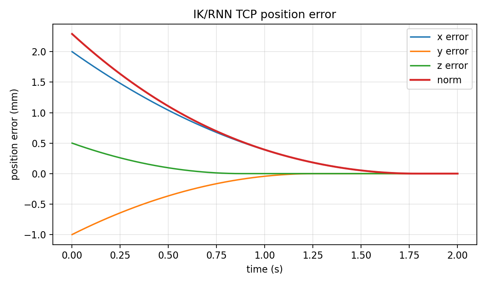
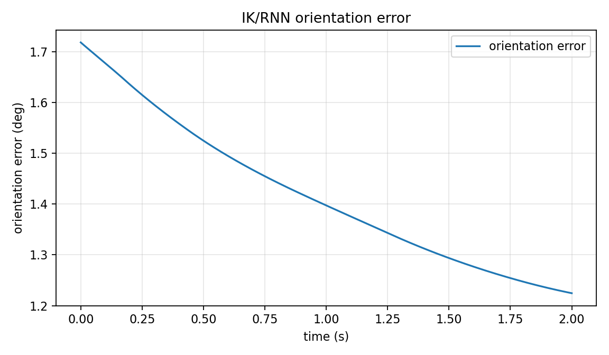
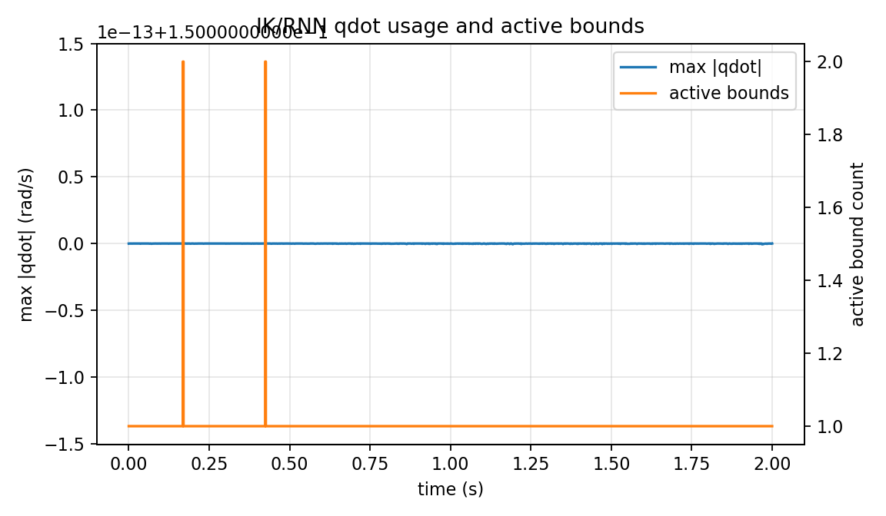

# IK/RNN Offline Frontier V152 Report

Date: 2026-06-12

Branch: `exp/tase-ur10e-v152-ik-rnn-offline-frontier`

## Scope

V152 starts the next offline work item after the Step6 outer-loop eight-shape
run: an inner-loop constrained IK/RNN frontier. The goal is not to fine-tune
the completed Step6 bridge parameters. The goal is to put a small finite-time
RNN-style Cartesian pose correction behind the existing MuJoCo kinematics,
velocity-level constrained IK, qdot limits, and run-artifact/report pipeline.

This is an offline simulation artifact only. It does not access the live UR10e,
does not write RTDE registers, does not run a Teach Pendant program, and does
not resolve the V151 contact-force coverage gap.

## Result

Canonical run:

```text
runs/ik_rnn_offline_frontier/20260612T000000
```

Key metrics:

| Metric | Value |
| --- | ---: |
| `audit_passed` | `true` |
| initial position error | `2.291287847477922 mm` |
| final position error | `0.0000034770204750937506 mm` |
| position error reduction | `2.291284370457447 mm` |
| initial orientation error | `1.7188733853924707 deg` |
| final orientation error | `1.224465934208661 deg` |
| orientation error reduction | `0.49440745118380963 deg` |
| solver success fraction | `1.0` |
| qdot limit | `0.15 rad/s` |
| max abs qdot | `0.15 rad/s` |
| max qdot utilization | `1.0` |
| qdot saturation fraction at 98% | `1.0` |
| completion claim allowed | `false` |

Interpretation:

The position part of the offline finite-time IK/RNN stepper converges cleanly
on this small pose target and stays inside the selected `0.15 rad/s` qdot
envelope. The orientation part also moves in the correct direction, but it is
not fully converged in the 2 s frontier run.

The qdot plot is the main engineering warning: the run is qdot-limited for the
whole interval. That is acceptable for a first frontier artifact because the
selected qdot bound is enforced and no hidden qdot clipping is detected, but it
means this run should be treated as a constrained feasibility probe, not as a
margin-rich tuned controller.

## Figures







## What Was Added

- `src/tase_repro/ik_rnn.py`
  implements a bounded finite-time Cartesian velocity law and wraps the
  existing constrained IK solver.
- `scripts/run_ik_rnn_offline_frontier.py`
  generates metrics, summary, three PNG figures, and git-state provenance.
- `tests/test_ik_rnn_offline_frontier.py`
  checks finite-time velocity bounding, position-error reduction, orientation
  error reduction, solver success, and qdot bound enforcement.

Tracked lightweight run artifacts include `metrics.yaml`, `metrics.json`,
`summary.md`, `git_state.md`, and the PNG figures. The raw `.npz` file is
generated locally but remains ignored by repository policy for generated
numeric payloads.

## Limit

V152 is an offline inner-loop IK/RNN frontier only. It does not prove strict
paper-equivalent feasibility, robustness, contact-model acceptance, setup-target
acceptance, hardware readiness, or completion. It also does not replace the
required force plots in Step6-style reproduction reporting; force (`fz`) remains
mandatory for any report that claims constant-force behavior.

## Next Step

Since the large platform is not ready and the Step6 outer loop already has a
completed reproduction run, the practical next progress item is to continue the
IK/RNN inner-loop line offline:

- reduce qdot saturation by separating linear and angular correction budgets,
- add an IK/RNN comparison baseline against the existing velocity-level IK,
- only return to Step6 outer-loop tuning when new hardware evidence or a report
question requires it.

## Validation

- `python3 -m py_compile src/tase_repro/ik_rnn.py scripts/run_ik_rnn_offline_frontier.py`
- `scripts/run_tests.sh tests/test_ik_rnn_offline_frontier.py`
  reported `4 passed in 0.27s`.
- `python3 scripts/run_ik_rnn_offline_frontier.py --run-id 20260612T000000`
- PNG sanity check found all three generated plots nonblank.
